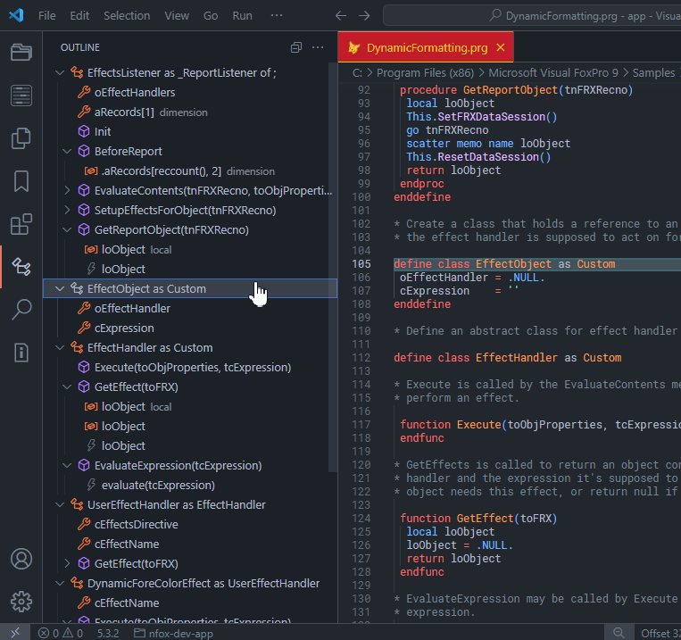

# Visual Foxpro Outline

Outline view extension for Visual Studio Code  

Please make a donation to fuel the development of new FoxPro extensions for VS Code!

## Features

- Class & Object definitions
- Properties & variables  
- Procedure & Function definitions with parameters
- Return Values

## Change Log

1.3.11

- updated package.json
  
1.3.1

- maintenance release

1.3.0

- Support for "add object" & array dimension()
- minor bug fix  

1.2.2

- fixed bug when code contains variable names starting with "return"
  
1.2.1

- show Public / Protected / Hidden definitions
- show class properties  
- show variable value assignment in methods
  
1.1.1  

- Bug fix: return value, declarations and comment tags  now correctly shown as child nodes of procedures/functions
  
1.1.0

- local & private declarations
- #define & #include
- show comment lines starting with "*> "
- return icon changed

1.0.2

- return statements w/o values shown correctly
- added detection of abbreviated procedure & function names ( proc , func )
- source code available on github
  
2025, Marco Plaza  
[GitHub/nfoxdev](https://github.com/nfoxdev)  
